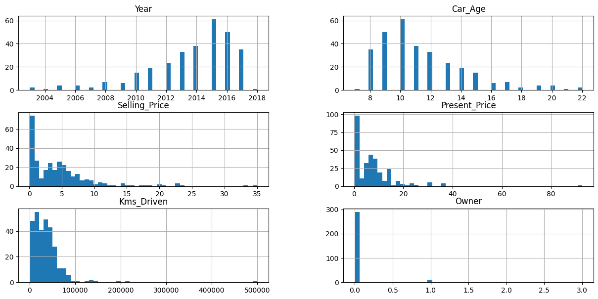
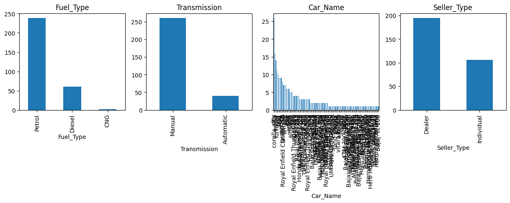
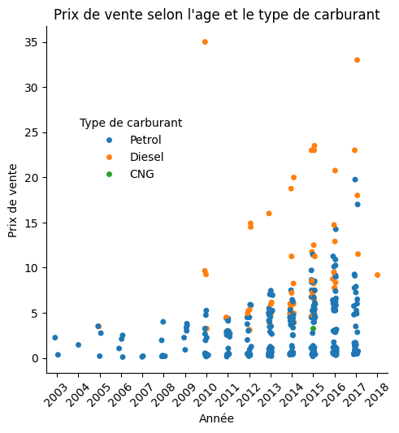
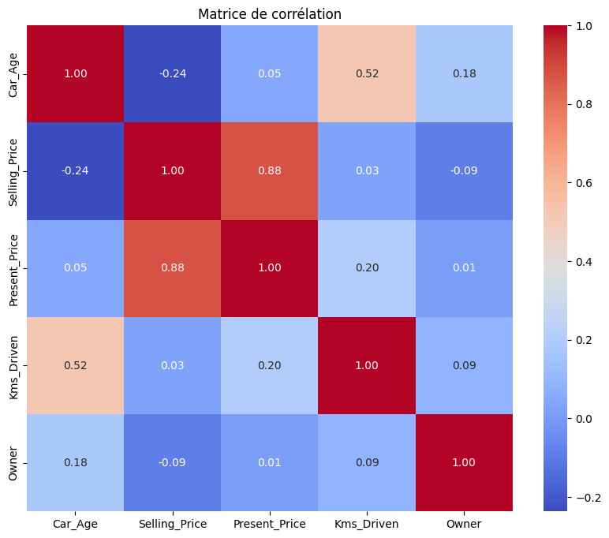

# new-car
Exercice de régression linéaire

## table des matière
- [Contexte du projet](#contexte)
- [Analyse de données](#exploration_des_donnees)
- [algorithme utilisé](#algorithme_de_regressio_lineaire_univariee)
- [conclusion](#conclusion)

## Contexte

**Fichier source :**
https://drive.google.com/file/d/1vbls3IbkrZOOaAlXZWOpA4W8Mij4pEr7/view

## Exploration des données

#### Taille du jeu de données

301 entrées, 9 colonnes

- 1 variable numérique : Year **peut être convertie en age**
- 3 variables quantitatives continues : Selling_Price, Present_Price, Kms_Driven
- 4 variables qualitatives : Car_Name, Fuel_Type, Seller_Type, Transmission
- 1 variable catégorielle (ordinale, pas continue) : Owner

#### Statistiques de base (moyenne, médiane, quartile)

<table border="1" class="dataframe">
  <thead>
    <tr style="text-align: right;">
      <th></th>
      <th>Year</th>
      <th>Selling_Price</th>
      <th>Present_Price</th>
      <th>Kms_Driven</th>
      <th>Owner</th>
    </tr>
  </thead>
  <tbody>
    <tr>
      <th>count</th>
      <td>301.000000</td>
      <td>301.000000</td>
      <td>301.000000</td>
      <td>301.000000</td>
      <td>301.000000</td>
    </tr>
    <tr>
      <th>mean</th>
      <td>2013.627907</td>
      <td>4.661296</td>
      <td>7.628472</td>
      <td>36947.205980</td>
      <td>0.043189</td>
    </tr>
    <tr>
      <th>std</th>
      <td>2.891554</td>
      <td>5.082812</td>
      <td>8.644115</td>
      <td>38886.883882</td>
      <td>0.247915</td>
    </tr>
    <tr>
      <th>min</th>
      <td>2003.000000</td>
      <td>0.100000</td>
      <td>0.320000</td>
      <td>500.000000</td>
      <td>0.000000</td>
    </tr>
    <tr>
      <th>25%</th>
      <td>2012.000000</td>
      <td>0.900000</td>
      <td>1.200000</td>
      <td>15000.000000</td>
      <td>0.000000</td>
    </tr>
    <tr>
      <th>50%</th>
      <td>2014.000000</td>
      <td>3.600000</td>
      <td>6.400000</td>
      <td>32000.000000</td>
      <td>0.000000</td>
    </tr>
    <tr>
      <th>75%</th>
      <td>2016.000000</td>
      <td>6.000000</td>
      <td>9.900000</td>
      <td>48767.000000</td>
      <td>0.000000</td>
    </tr>
    <tr>
      <th>max</th>
      <td>2018.000000</td>
      <td>35.000000</td>
      <td>92.600000</td>
      <td>500000.000000</td>
      <td>3.000000</td>
    </tr>
  </tbody>
</table>

####  Distribution des données (histogramme).
variables quantitatives continues

variables qualitatives et catégorielles

####  Tracé catplot
Ce type de tracé est pertinent  pour afficher les relations entre une variable numérique et une ou plusieurs variables catégorielles.
Ci-dessous le prix de vente suivant l'âge du véhicule et le type de carburant :

####  Quantifiez la relation entre l'âge et le prix de vente.

####  Réalisez une veille sur la régression linéaire.

####  Est-ce que notre jeux de données est adapté à ce type d'algorithme ?

####  Existe-t-il une corrélation linéaire (corrélation de Pearson) entre les variables ?
La conversion de variables qualitatives en variables quantitatives pour calculer une matrice de corrélation n'est pas pertinente.
Il vaut mieux n'utiliser que les variables quantitatives ou ordinal ( Owner ) du jeu de données :
- Car_Age
- Selling_Price
- Present_Price
- Kms_Driven
- Owner

Le prix de vente semble correlé positivement avec :
- le prix de départ-usine

Le prix de vente semble correlé négativement avec :
- l'âge du véhicule
- le nombre de propriétaire
- les km parcourus impactent faiblement le prix

####  Proposez un outil de visualisation de Matplotlib permettant d'appuyer votre argumentation.

## Algorithme de régression linéaire univariée

Librairies :
○ Scipy
○ Scikit-Learn

variable explicative : Car_Age
variable cible : Selling_Price

## Amélioration du modèle
en utilisant plusieurs variables d'entrée (Kms_Driven et Transmission)

## Réalisation d'une régression linéaire multiple en Python avec sklearn.

7. Évaluez vos modèles de régression avec des mesures de qualité d’un
algorithme de régression linéaire.
8. Concluez votre analyse (par exemple : les facteurs contribuant au prix
d’une voiture).
9. Martin souhaite acheter un véhicule ayant moins de 7 ans, pas plus
de 100 000 km, avec une boite manuelle. Aidez Martin à estimer le prix
d’une voiture avec ces caractéristiques.

## Conclusion
