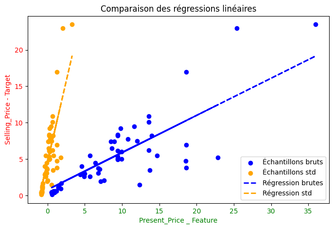

# new-car
Exercice de régression linéaire

## table des matière
- [Contexte du projet](#contexte)
- [Analyse de données](#exploration_des_donnees)
- [Données avant traitement](#donnees_avant_traitement)
- [Données après traitement](#donnees_apres_traitement)
- [Standardisation des données](#standardisation_des_donnees)
- [algorithme utilisé](#algorithme_de_regressio_lineaire_univariee)
- [conclusion](#conclusion)


## Contexte

**Fichier source :**

https://drive.google.com/file/d/1vbls3IbkrZOOaAlXZWOpA4W8Mij4pEr7/view

**Environnement virtuel :**

Pour ce projet, l'environnement virtuel s'appelle `new_car_venv`
La liste des dépendances nécessaires est listée dans le fichier [requirements.txt](requirements.txt)

Pour exécuter les fichiers, il faut d'abord activer l'environnement avec la ligne de commande suivante :
```bash
$ source new_car_venv/Scripts/activate
```
---
## Exploration des données

#### Taille du jeu de données

301 entrées, 9 colonnes

- 1 variable numérique : Year **peut être convertie en age**
- 3 variables quantitatives continues : Selling_Price, Present_Price, Kms_Driven
- 4 variables qualitatives : Car_Name, Fuel_Type, Seller_Type, Transmission
- 1 variable catégorielle (ordinale, pas continue) : Owner

### Données avant traitement
#### Statistiques de base (moyenne, médiane, quartile)

<div>
<table border="1" class="dataframe">
  <thead>
    <tr style="text-align: right;">
      <th></th>
      <th>Year</th>
      <th>Selling_Price</th>
      <th>Present_Price</th>
      <th>Kms_Driven</th>
      <th>Owner</th>
    </tr>
  </thead>
  <tbody>
    <tr>
      <th>count</th>
      <td>301.000000</td>
      <td>301.000000</td>
      <td>301.000000</td>
      <td>301.000000</td>
      <td>301.000000</td>
    </tr>
    <tr>
      <th>mean</th>
      <td>2013.627907</td>
      <td>4.661296</td>
      <td>7.628472</td>
      <td>36947.205980</td>
      <td>0.043189</td>
    </tr>
    <tr>
      <th>std</th>
      <td>2.891554</td>
      <td>5.082812</td>
      <td>8.644115</td>
      <td>38886.883882</td>
      <td>0.247915</td>
    </tr>
    <tr>
      <th>min</th>
      <td>2003.000000</td>
      <td>0.100000</td>
      <td>0.320000</td>
      <td>500.000000</td>
      <td>0.000000</td>
    </tr>
    <tr>
      <th>25%</th>
      <td>2012.000000</td>
      <td>0.900000</td>
      <td>1.200000</td>
      <td>15000.000000</td>
      <td>0.000000</td>
    </tr>
    <tr>
      <th>50%</th>
      <td>2014.000000</td>
      <td>3.600000</td>
      <td>6.400000</td>
      <td>32000.000000</td>
      <td>0.000000</td>
    </tr>
    <tr>
      <th>75%</th>
      <td>2016.000000</td>
      <td>6.000000</td>
      <td>9.900000</td>
      <td>48767.000000</td>
      <td>0.000000</td>
    </tr>
    <tr>
      <th>max</th>
      <td>2018.000000</td>
      <td>35.000000</td>
      <td>92.600000</td>
      <td>500000.000000</td>
      <td>3.000000</td>
    </tr>
  </tbody>
</table>
</div>

####  Distribution des données (histogramme).
variables quantitatives continues

variables qualitatives et catégorielles


**outliers**<br>
Sur 300 observations, seulement 11 ont une valeur autre que 0 pour la variable Owner :<br>

|Valeur de Owner|nombre d'observations|
|-|-|
|0 |   290|
|1  |   10|
|3  |    1|

####  Tracé catplotOwner
Ce type de tracé est pertinent  pour afficher les relations entre une variable numérique et une ou plusieurs variables catégorielles.
Ci-dessous le prix de vente suivant l'âge du véhicule et le type de carburant :<br>


### Données après traitement

Ci dessous l'output de `.describe` après traitement des données
<div>
<style scoped>
    .dataframe tbody tr th:only-of-type {
        vertical-align: middle;
    }

    .dataframe tbody tr th {
        vertical-align: top;
    }

    .dataframe thead th {
        text-align: right;
    }
</style>
<table border="1" class="dataframe">
  <thead>
    <tr style="text-align: right;">
      <th></th>
      <th>Car_Name</th>
      <th>Year</th>
      <th>Selling_Price</th>
      <th>Present_Price</th>
      <th>Kms_Driven</th>
      <th>Fuel_Type</th>
      <th>Seller_Type</th>
      <th>Transmission</th>
    </tr>
  </thead>
  <tbody>
    <tr>
      <th>count</th>
      <td>251</td>
      <td>251.000000</td>
      <td>251.000000</td>
      <td>251.000000</td>
      <td>251.000000</td>
      <td>251</td>
      <td>251</td>
      <td>251</td>
    </tr>
    <tr>
      <th>unique</th>
      <td>87</td>
      <td>NaN</td>
      <td>NaN</td>
      <td>NaN</td>
      <td>NaN</td>
      <td>2</td>
      <td>2</td>
      <td>2</td>
    </tr>
    <tr>
      <th>top</th>
      <td>city</td>
      <td>NaN</td>
      <td>NaN</td>
      <td>NaN</td>
      <td>NaN</td>
      <td>Petrol</td>
      <td>Dealer</td>
      <td>Manual</td>
    </tr>
    <tr>
      <th>freq</th>
      <td>25</td>
      <td>NaN</td>
      <td>NaN</td>
      <td>NaN</td>
      <td>NaN</td>
      <td>208</td>
      <td>163</td>
      <td>230</td>
    </tr>
    <tr>
      <th>mean</th>
      <td>NaN</td>
      <td>2014.175299</td>
      <td>3.936375</td>
      <td>6.166068</td>
      <td>30724.864542</td>
      <td>NaN</td>
      <td>NaN</td>
      <td>NaN</td>
    </tr>
    <tr>
      <th>std</th>
      <td>NaN</td>
      <td>2.101701</td>
      <td>3.096530</td>
      <td>4.856053</td>
      <td>20015.591801</td>
      <td>NaN</td>
      <td>NaN</td>
      <td>NaN</td>
    </tr>
    <tr>
      <th>min</th>
      <td>NaN</td>
      <td>2009.000000</td>
      <td>0.160000</td>
      <td>0.320000</td>
      <td>500.000000</td>
      <td>NaN</td>
      <td>NaN</td>
      <td>NaN</td>
    </tr>
    <tr>
      <th>25%</th>
      <td>NaN</td>
      <td>2013.000000</td>
      <td>0.925000</td>
      <td>1.230000</td>
      <td>15000.000000</td>
      <td>NaN</td>
      <td>NaN</td>
      <td>NaN</td>
    </tr>
    <tr>
      <th>50%</th>
      <td>NaN</td>
      <td>2015.000000</td>
      <td>3.750000</td>
      <td>5.900000</td>
      <td>29000.000000</td>
      <td>NaN</td>
      <td>NaN</td>
      <td>NaN</td>
    </tr>
    <tr>
      <th>75%</th>
      <td>NaN</td>
      <td>2016.000000</td>
      <td>5.875000</td>
      <td>9.400000</td>
      <td>45000.000000</td>
      <td>NaN</td>
      <td>NaN</td>
      <td>NaN</td>
    </tr>
    <tr>
      <th>max</th>
      <td>NaN</td>
      <td>2018.000000</td>
      <td>12.900000</td>
      <td>20.450000</td>
      <td>88000.000000</td>
      <td>NaN</td>
      <td>NaN</td>
      <td>NaN</td>
    </tr>
  </tbody>
</table>
</div>

---


####  Quantifiez la relation entre l'âge et le prix de vente.

####  Réalisez une veille sur la régression linéaire.

####  Est-ce que notre jeux de données est adapté à ce type d'algorithme ?
Il y a plusieurs points à prendre en considération car il peuvent perturber la modélisation :<br>

- Les variables ont des echelles différentes.
- variables quantitative/qualitative/ordinale

kilométrage minimum : 500
kilométrage maximum : 500 000

**Il faut standardiser ou normaliser les données**
## Normalisation des données
Technique de prétraitement des données (aussi appelée standardisation).
Transforme les variables pour qu'elles aient une **moyenne de 0** et un **écart-type de 1**.
$$\boxed{\mu = 0 \text{ et }\sigma = 1 }$$

**Avant normalisation**
les coefficients des variables dans un modèle prédictif reflètent simplement l'influence des variables d'entrée (features) sur la variable cible dans leurs unités d'origine.<br>
Cette représentation peut être trompeuse lorsque les variables ont des échelles ou des unités différentes.

**Après normalisation**
les coefficients des variables deviennent directement comparables entre eux. Ils indiquent leur influence relative sur le modèle.
Un coefficient plus élevé en valeur absolue signifie que la variable correspondante a un impact plus important sur la prédiction, indépendamment de son échelle d'origine.


- Améliore la convergence des algorithmes d'optimisation comme la descente de gradient
- Permet d'éviter que certaines variables dominent le modèle uniquement en raison de leur amplitude
- Facilite l'interprétation comparative des coefficients du modèle
- Indispensable pour de nombreux algorithmes sensibles à l'échelle des données, comme les SVM ou les réseaux de neurones
- Accélère l'apprentissage en favorisant un paysage d'optimisation plus régulier

La normalisation est particulièrement importante dans les modèles multivariés, mais peut également apporter des bénéfices dans les cas univariés, notamment pour la stabilité numérique et l'interprétation des résultats.
<br>
**MinMaxScaler**
Ramene les données à l'intérieur d'un intervalle spécifique. Par défaut, la plus petite valeur sera ramenée à 0 et la plus grande à 1.
**StandardScaler**
Centrer les données sur 0 et/ou les ramener à un écart-type de 1.

|Scaler|Objectif|Effet sur les données|Utilisation typique|
|-|-|-|-|
|StandardScaler	|Centre les données autour de 0 et ajuste l’écart-type à 1	|Peut produire des valeurs négatives et supérieures à 1	| Régression linéaire, SVM, K-Means, PCA|
|MinMaxScaler	|Ramène les données dans un intervalle spécifique (souvent [0,1])|	Toutes les valeurs sont entre 0 et 1	| Réseaux de neurones, KNN, algos sensibles aux distances|

```python
from sklearn.preprocessing import MinMaxScaler
scaler = MinMaxScaler()
df['Kms_Scaled'] = scaler.fit_transform(df[['Kms_Driven']])
```


---
**Stratification des données**
Classer les prix en catégories en fonction d'un intervalle de 1.5 unités, avec un maximum de 5 catégories.
Transforme une variable continue en variable catégorielle.
```python
df['Price_Category'] = np.ceil(df['Selling_Price'] / 1.5)
df['Selling_Price'] / 1.5 
```
- Chaque valeur de Selling_Price est divisée par 1.5.
- La fonction `ceil()` arrondit chaque valeur à l'entier supérieur.
- Classification où chaque tranche de 1.5 unités de Selling_Price correspond à une nouvelle catégorie.

```python
df['Price_Category'] = df['Price_Category'].where(df['Price_Category'] <5, 5.0)
```

- Limitation des valeurs à un maximum de 5
- Toutes les valeurs de Price_Category supérieures ou égales à 5 sont remplacées par 5.0.
---


####  Existe-t-il une corrélation linéaire (corrélation de Pearson) entre les variables ?
La conversion de variables qualitatives en variables quantitatives pour calculer une matrice de corrélation n'est pas pertinente.
Il vaut mieux n'utiliser que les variables quantitatives ou ordinal ( Owner ) du jeu de données :
- Car_Age
- Selling_Price
- Present_Price
- Kms_Driven
- Owner

Le prix de vente semble correlé positivement avec :
- le prix de départ-usine

Le prix de vente semble correlé négativement avec :
- l'âge du véhicule
- le nombre de propriétaire
- les km parcourus impactent faiblement le prix

**Il faut peut être les standardiser toutes les variables avant de chercher une corrélation**


####  Proposez un outil de visualisation de Matplotlib permettant d'appuyer votre argumentation.


## Algorithme de régression linéaire univariée

Avec les ibrairies Scipy et Scikit-Learn.

La **régression linéaire univariée** utilise **une seule variable explicative** : 
||$$\boxed{𝑦=𝑎𝑋+𝑏}$$|
|-|-|
|𝑋 | variable explicative (ex. Present_Price)|
|𝑦 | variable cible (Selling_Price)|
|𝑎 | coefficient de la pente|
|𝑏 |ordonnée à l'origine (intercept)|

## Amélioration du modèle
en utilisant plusieurs variables d'entrée (Kms_Driven et Transmission)

## Réalisation d'une régression linéaire multiple en Python avec sklearn.

7. Évaluez vos modèles de régression avec des mesures de qualité d’un
algorithme de régression linéaire.
8. Concluez votre analyse (par exemple : les facteurs contribuant au prix
d’une voiture).
9. Martin souhaite acheter un véhicule ayant moins de 7 ans, pas plus
de 100 000 km, avec une boite manuelle. Aidez Martin à estimer le prix
d’une voiture avec ces caractéristiques.


## Conclusion
